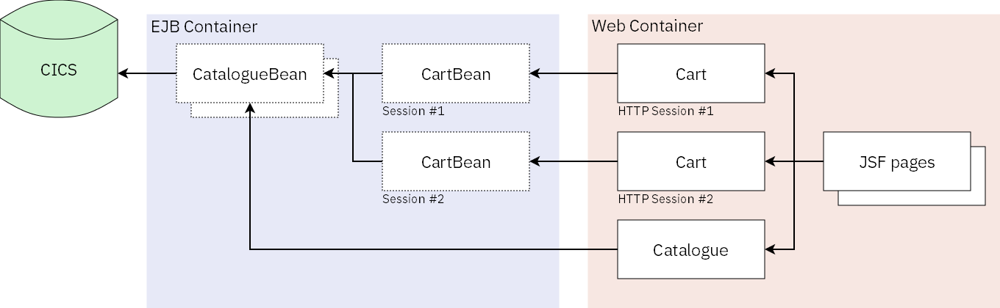
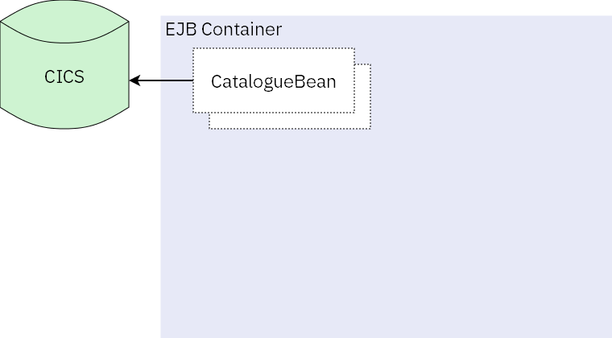
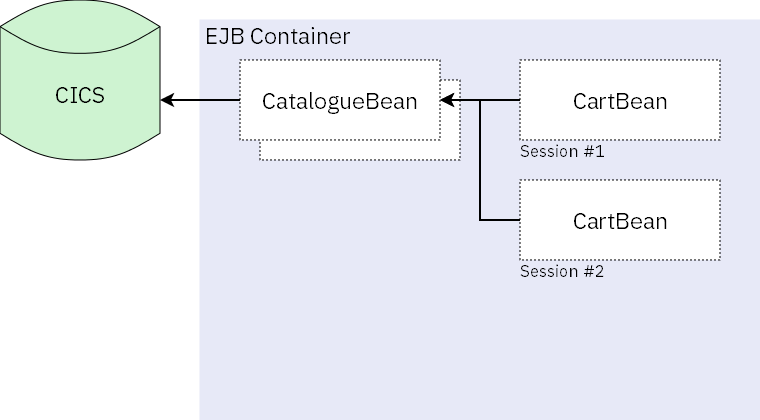

EJBs in Liberty JVM server - a Web Shop example
================================================

Enterprise JavaBeans (EJBs) are a core part of Java EE (Java Enterprise
Edition) and are used to contain the business logic for enterprise
applications. In CICS TS 5.4, the Liberty JVM server supports the full
EJB 3.2 specification.

In this guide for the Java developer we create a simple online store
using EJBs. The full sample is available on the CICS GitHub repository:
[cics-java-liberty-ejb](https://github.com/cicsdev/cics-java-liberty-ejb).

This is what the architecture for the sample looks like for the web
shop. Through the article we'll explain the various parts in detail:



Introduction to EJBs
--------------------

*What is an EJB?*\
An EJB is a re-usable Java class containing a no-argument constructor
along with metadata to describe its characteristics and behaviour. EJBs
are typically used to encapsulate business logic for enterprise
applications. The metadata can be provided by annotations within the
class and allow the class to be registered into an EJB container.
Metadata can also be provided by XML descriptor files, some options can
only be defined in these descriptors. The EJB container manages aspects
of the EJB such as transactionality, security, and life cycle.

*Why use EJBs?*\
EJBs are a mature standard that have seen significant evolution in
usability from early versions to the recent 3.1/3.2 specifications. Like
CDI and managed beans, they provide an injection framework. EJBs
however, provide useful extras like asynchronous method invocation,
timers and even the ability to perform remote method invocation.

**Note:** WebSphere Liberty supports EJB Lite 3.1 and EJB 3.2 (including
EJB Lite 3.2)\
The Liberty JVM server in CICS provides the following CICS
release/maintenance level dependent support:\
CICS Transaction Server for z/OS 5.4.0 supports EJB 3.2 (including EJB
Lite 3.2).\
CICS Transaction Server for z/OS 5.3.0 provides EJB Lite 3.2 support
through the Continuous Delivery APAR PI63877.\
CICS Transaction Server for z/OS 5.3.0 provides EJB 3.2 (including EJB
Lite 3.2) support through the Continuous Delivery APAR PI77502.\
CICS Transaction Server for z/OS 5.3.0 and 5.4.0 support EJB Lite 3.1.

The EJB specification defines two types of beans:

1.  Session beans
2.  Message Driven Beans (MDBs)

MDBs typically require a JMS queue or a JCA inbound resource adapter to
receive messages from. Here, we'll focus on session beans over MDBs, and
explain the concepts of session beans.

Supporting technologies
-----------------------

There are many technologies which can use or interact with EJBs. Here we
provide a quick introduction to some of the more common ones.

|   Specification|  Java EE 6 feature | Java EE 7 feature  | Description |
|----------------|--------------------|--------------------|-------------|
|Java Naming and Directory Interface (JNDI)   | `jndi-1.0`  |   |  JNDI is a Java API which allows application programs to look up data and objects via a given name. It's a technology which underpins a lot of other Java EE technologies, especially those which deal with injection. The EJB container registers an EJB to a JNDI name, allowing easy injection into other classes. |  
|Java Servlets  | `servlet-3.0`  | `servlet-3.1`  |  Java servlets are classes which can respond to requests, emulating server behaviour. Commonly these are used to respond to HTTP requests, acting like a web server. Servlets are run and managed by the web container and can receive objects injected by JNDI.|  
|JavaServer Pages (JSP)  |`jsp-2.1`   | `jsf-2.2`  | JSPs is a server-side technology for dynamically generating web pages. Pages are defined using a markup language built on HTML and XML and are compiled into Servlets. JavaBeans (classes with only setter and getter methods) can be used to provide backing code for the scripting elements in the JSP page. EJBs can be injected into the JavaBeans using JNDI.  |
|JavaServer Faces (JSF)  | `jsf-2.0`  |`jsf-2.2`   | JSF is a similar technology to JSP, but focuses more on the Model-View-Controller design pattern. Like JSP, JSF pages are written in a markup language based on HTML and XML. JSF pages are backed by JSF managed beans. Similar to EJBs, JSF managed beans are defined using annotations. JSF managed beans can map to the HTTP session scope, allowing for much easier control of session state. EJBs can be injected into JSF managed beans using JNDI. |  
|Java API for RESTful Web Services (JAX-RS) |`jaxrs-1.1`   |  `jaxrs-2.0` |  JAX-RS is a Java API for developing RESTful Web Services. A JAX-RS application is a set of classes which define the RESTful API. These classes can have EJBs injected into them via JNDI, using the `InitialContext` class, or can themselves be defined as EJBs and have EJBs injected via the `@EJB` annotation. |  
|EJB Lite  |`ejbLite-3.1`   |`ejbLite-3.2`   | A subset of EJB features which provides the basic functionality of local EJB session beans. In EJB Lite 3.2, this also includes non-persistent timers and asynchronous methods.  |  
|EJB Persistent Timers|  Not supported| `ejbPersistentTimers-3.2`  | Allows EJB timers to be persisted to a data source.  |
|Remote EJB method invocation   |  Not supported | `ejbRemote-3.2`  | Allows EJB methods to be invoked remotely via CORBA.  |  
|EJB home interfaces  |  Not supported | `ejbHome-3.2`  |  Adds backwards compatibility for EJBs written to the 2.X versions of the JB specification |  
|EJB  |Not supported   |`ejb-3.2`   | Adds support for all EJB functionality (EJB Lite, persistent timers, remote method invocation and home interfaces).  |  

**Note:** One of the benefits of WebSphere Liberty is you can control
which functionality is active. If you don't need remote EJBs then you
can avoid running an IIOP server by only using the EJB Lite feature.

Using Session Beans to Write Business Logic
-------------------------------------------

In our web store example, we need logic to load the catalogue of items
that the shop has for sale. We can use any method of loading the
catalogue. Catalogue data would typically be stored in a database or
even in VSAM data sets. The JCICS API provides access to the data in
VSAM, while a JDBC driver would provide access to a relational database
such as IBM Db2.

When you are writing business logic in an EJB, it is common to write a
single EJB for each logical unit of the application. This approach
promotes reuse and separation of transaction contexts, etc. Here we
create a session bean which will manage all interaction with the
catalogue:

``` {.brush: .java; .highlight: .[8]; .title: .CatalogueBean.java; .notranslate title="CatalogueBean.java"}
package com.ibm.cicsdev.ejb;    

import java.io.IOException;
import java.util.List;

import javax.ejb.Stateless;

@Stateless
public class CatalogueBean
{
    public List<Item> getCatalogue() throws IOException
    {
        // ...
    }
}
```

The highlighted line (line 8) defines the `CatalogueBean` class as being
an EJB session bean. The EJB container registers this class to a JNDI
name. This allows the bean to be injected into other classes, without
the need for these classes to instantiate this bean. In Liberty, the
JNDI name follows one of the following conventions:

-   `java:global[/application name]/module name/enterprise bean name[!interface name]`
-   `java:module/enterprise bean name[!interface name]`
-   `java:app[/module name]/enterprise bean name[!interface name]`

When registering a bean into the EJB container, Liberty provides a
informational message to show the actual name of the bean in the
`java:global` namespace:

``` {.brush: .plain; .light: .true; .title: .; .notranslate title=""}
[6/29/17 15:04:16:019 GMT] 0000003f com.ibm.ws.ejbcontainer.runtime.AbstractEJBRuntime           I CNTR0167I: The server is binding the com.ibm.cicsdev.ejb.CatalogueBean interface of the CatalogueBean enterprise bean in the com.ibm.cicsdev.ejb.jar module of the com.ibm.cicsdev.ejb application.  The binding location is: java:global/com.ibm.cicsdev.ejb/com.ibm.cicsdev.ejb/CatalogueBean!com.ibm.cicsdev.ejb.CatalogueBean
```

At this point our architecture looks like this:



Using Session Beans to Manage State in Applications
---------------------------------------------------

Where appropriate, tracking state in web applications can offer
benefits. For our web store, we want to track state for a shopping cart.
Session beans provide three different kinds of state, depending on the
requirements of the session bean.

1.  *Singleton* session beans exist once in the container. Every time
    you inject a singleton session bean, you will get the same object.
2.  *Stateless* session beans can exist multiple times in the container.
    Generally, the container will have a pool of stateless beans, so
    injection may provide the same object or a completely different one.
3.  *Stateful* session beans have a more complex lifecycle. This is
    ***not*** the same as a HTTP session. Instead, each time you inject
    a stateful session bean, you will receive a new object. This type of
    bean will exist in the container until the application chooses to
    destroy it.

The container also manages the lifecycle of these objects. Every type of
bean has two basic states: non-existent and ready. Stateful beans have a
third state: passive. Singleton session beans exist only once and
stateless beans are (typically) pooled by the container. This makes it
easy to control how much memory they take up. The container cannot
control the amount of memory that stateful beans take up, as the
application must remove them. Instead, the container can choose to
passivate stateful session bean into secondary storage away from memory,
putting it into a passive state. Later, when the object is needed again,
the container resumes the bean by moving it back into memory.


The lifecycle for stateless and singleton beans is essentially the same,
they can be created and destroyed. Singleton beans are created either
when they are first injected, or when the application is started (when
the `@Startup` annotation is present). Stateless beans go through the
same sort of lifecycle as singletons, just with more than one bean in
the pool.


Having acquired an understanding of stateful session beans, let's see
one in action for our shopping cart example:

``` {.brush: .java; .highlight: .[9,32]; .title: .CartBean.java; .notranslate title="CartBean.java"}
package com.ibm.cicsdev.ejb;

import java.io.IOException;
import java.util.List;

import javax.ejb.Remove;
import javax.ejb.Stateful;

@Stateful
public class CartBean
{
    public boolean add(Item item)
    {
        // ...
    }

    public boolean remove(Item item)
    {
        // ...
    }

    public List<Item> getItems()
    {
        // ...
    }

    public boolean purchase() throws IOException
    {
        // ...
    }

    @Remove
    public void clear()
    {
        // ...
    }
}
```

Every time we inject this class, we will get a whole new instance. This
instance will exist until we call the `clear` method which is annotated
`@Remove`, highlighted in the example above.

Now our architecture looks like this:



Building a frontend using EJBs
------------------------------

Now that we have our session beans, let's look at how to use them. One
of the easiest ways to employ them is in JSF, but you can also use EJBs
in servlets, JSP pages, JAX-RS applications and various other
technologies.

EJBs can be injected into other classes in many ways. The simplest is to
annotate the injection point with the `@EJB` annotation and have the
container manage it. In the following example, we inject the Catalogue
session bean into a JSF managed bean. This managed bean can then be used
directly in JSF pages.

``` {.brush: .java; .highlight: .[15]; .title: .; .notranslate title=""}
package com.ibm.cicsdev.ejb.shop.web;

import java.io.IOException;
import java.util.Collection;

import javax.ejb.EJB;
import javax.faces.bean.ManagedBean;

import com.ibm.cicsdev.ejb.CatalogueBean;
import com.ibm.cicsdev.ejb.Item;

@ManagedBean
public class Catalogue
{
    @EJB
    private CatalogueBean catalogue;

    public Collection<Item> getItems() throws IOException {
        return this.catalogue.getCatalogue();
    }
}
```

EJBs can also be looked up using JNDI APIs. Sometimes doing so is
unavoidable, especially when dealing with HTTP session state. As
mentioned ealier EJB sessions and HTTP sessions are two separate items.
To track a stateful session bean by a HTTP session, you would need to
create a HTTP session and put the session bean into it, for example:

``` {.brush: .java; .highlight: .[25]; .title: .; .notranslate title=""}
import java.io.IOException;

import javax.naming.InitialContext;
import javax.naming.NamingException;
import javax.servlet.ServletException;
import javax.servlet.annotation.WebServlet;
import javax.servlet.http.HttpServlet;
import javax.servlet.http.HttpServletRequest;
import javax.servlet.http.HttpServletResponse;
import javax.servlet.http.HttpSession;

import com.ibm.cicsdev.ejb.CartBean;

@WebServlet("/cart")
public class CartServlet extends HttpServlet
{
    protected void doGet(HttpServletRequest request, HttpServletResponse response) throws ServletException, IOException
    {
        HttpSession session = request.getSession();

        if(session.isNew())
        {
            try
            {
                CartBean cart = InitialContext.doLookup("java:global/com.ibm.cicsdev.ejb.app/com.ibm.cicsdev.ejb/CartBean!com.ibm.cicsdev.ejb.CartBean");
                session.setAttribute("cart", cart);
            }
            catch (NamingException e)
            {
                // ...
            }

        }

        CartBean cart = (CartBean) session.getAttribute("cart");
        // ...
    }
}
```

After adding a JSF frontend, the architecture for our application looks
like this:


Data integrity
--------------

With the building blocks complete, we can now look at some of the more
useful elements the EJB container provides to application programmers.
In this section, we'll look at how to manage Java transactions in EJBs
and how CICS integrates with these transactions. Under the covers,
transaction work in the Java EE world is managed by JTA. In CICS we
integrate a JTA transaction with the CICS Unit of Work. In the article
[Using Java Transactions in CICS Liberty to coordinate JDBC
updates](https://developer.ibm.com/cics/2017/02/01/using-java-transactions-in-cics-liberty-to-coordinate-jdbc-updates/)
I discussed about JTA transactions interact with CICS. That's a great
starting point for understanding this concept.

The EJB container provides two methods of managing JTA transactions:

1.  Bean-managed
2.  Container-managed

Bean-managed transactions allow the EJB to manage the JTA transaction
directly through the UserTransaction class. You can then use this to
start, commit or rollback transactions as you would do in servlets (see
the article above for more information).

``` {.brush: .java; .highlight: .[12]; .title: .; .notranslate title=""}
import javax.annotation.Resource;
import javax.ejb.SessionContext;
import javax.ejb.Singleton;
import javax.transaction.UserTransaction;

@Singleton
public class BeanManagedTransactionBean {
    @Resource
    private SessionContext sessionContext;

    public void doTransactionalWork() {
        UserTransaction transaction = sessionContext.getUserTransaction();

        // ...
    }
}
```

Container-managed transactions do not interact with the UserTransaction
class. Instead annotations on the EJB at the class or method level
define what form of transaction the class/method requires. Annotations
at the class level are overridden by those at the method level. The
following table describes the behaviour which can be defined for the
transactional behaviour:

| Transaction Attribute  | No JTA transaction  |  Pre-existing JTA transaction|
|------------------------|---------------------|------------------------------|
| Mandatory  | Throws exception `EJBTransactionRequiredException`  |  Inherits the existing JTA transaction|
| Required  | EJB container creates new JTA transaction.   |  Inherits the existing JTA transaction|
| Requires new  | EJB container creates new JTA transaction.   |  Throws exception `javax.ejb.EJBException`.|
|   Supports   | Continues without a JTA transaction.       |  Inherits the existing JTA transaction. |
|   Not supported  | Continues without a JTA transaction.       |  Suspends the JTA transaction but not the CICS UoW. |
|  Never   | Continues without a JTA transaction.       |  Throws exception `javax.ejb.EJBException`. |


There are two transactional attributes which are restricted in CICS,
caused by the way CICS UOWs operate. *Requires New* will throw an
exception if it is called from within an existing transaction, as CICS
does not support the nesting of transactions. CICS UOWs cannot be
suspended, so the *Not Supported* transaction attribute cannot be
respected.

For our example, we require a transaction when purchasing the cart. The
choice of transaction attribute is one which needs to be properly
considered based on the architecture of the application being created.

``` {.brush: .java; .highlight: .[14]; .title: .; .notranslate title=""}
package com.ibm.cicsdev.ejb;

import java.io.IOException;

import javax.ejb.Stateful;
import javax.ejb.TransactionAttribute;
import javax.ejb.TransactionAttributeType;

@Stateful
public class CartBean
{
    // ...

    @TransactionAttribute(TransactionAttributeType.REQUIRED)
    public void purchase() throws IOException
    {
        // ...
    }
}
```

Re-using EJBs across applications
---------------------------------

When using the EJB Lite subset, you can access EJBs within the same
application. Usually it is best to create EJBs as part of an EAR
application, which can contain multiple WARs, EJB JARs, etc. Using EJB
3.2 allows access to EJBs across different applications running on the
same server, or even across servers.

For our example, we might also want to have a back-end system for
managing stock. For this we can re-use the Catalogue EJB, add extra
functionality to the bean and create another front-end. In our sample,
we've added a very basic JAX-RS webservice for stock management. Even in
this simple example, it's easy to find ways to re-use existing EJBs. We
could take this even further and consider making a RESTful API for the
store front for use with a mobile application.

There's now two things we need to prevent happening, one is anyone using
the RESTful webservice to alter stock items. The second is to ensure
that we don't accidentally expose any of this functionality through the
store without a proper authorisation. This brings us nicely onto our
final topic.

Securing Access to EJBs
-----------------------

Authorisation to EJB is done at both the class and the method level. As
with transaction attributes, when defined at the class level, the
authorisation applies to every method. When defined at the method level,
it overrides any class level authorisation. There are several
annotations which control authorisation to EJBs, which are defined
through the Java EE common annotations:

-   `@DeclareRoles` defines the roles which are used in the session bean
-   `@RolesAllow` defines which Java EE roles can access methods
-   `@DenyAll` prevents anyone from calling the method
-   `@PermitAll` allows everyone to call the method
-   `@RunAs` allows the method to be run under a declared user ID.
    Useful when developing applications.

Mainly, `@RolesAllowed` is the most useful for securing applications.
`@DenyAll` and `@PermitAll` can be useful for overriding class-level
security or disabling function.

As with servlets, the Java EE user principal will propagate to the CICS
transaction user ID when security is enabled on the CICS region. This
then allows CICS to perform the normal security checks, including
transaction security and resource security. However, it should be noted
that using `@RunAs` will not update the CICS user ID and the transaction
will continue to run under the user who initially called the EJB.

``` {.brush: .java; .highlight: .[10,13]; .title: .; .notranslate title=""}
package com.ibm.cicsdev.ejb;

import java.io.IOException;

import javax.annotation.security.DeclareRoles;
import javax.annotation.security.RolesAllowed;
import javax.ejb.Singleton;

@Stateless
@DeclareRoles("Administrator")
public class CatalogueBean
{
    @RolesAllowed("Administrator")
    public Item addStock(int id, int ammount) throws IOException
    {
    }
}
```

These roles map to the Java EE roles defined in the application and the
Liberty security configuration. When using z/OS security through SAF
EBJROLEs (also used by CICS security), these EJBROLEs can be passed
directly to the Java EE roles.

Further topics
--------------

The world of EJBs is large and I haven't been able to cover all elements
here. For those interested I've included some of the more interesting
ones:

-   Message driven beans (MDB) (*[Deploying message-driven beans within
    Liberty -- WebSphere Application Server for z/OS Liberty Knowledge
    Center](https://www.ibm.com/support/knowledgecenter/en/SS7K4U_liberty/com.ibm.websphere.wlp.zseries.doc/ae/twlp_dep_msg_mdb.html)*)
-   Asynchronous EJB methods
-   Timer EJBs (*[Developing Enterprise bean (EJB) persistent timer
    applications -- WebSphere Application Server for z/OS Liberty
    Knowledge
    Center](https://www.ibm.com/support/knowledgecenter/en/SS7K4U_liberty/com.ibm.websphere.wlp.zseries.doc/ae/twlp_ejb_perstimer.html)*)
-   Remote invocation of EJB methods (*[Enterprise Java™ Bean (EJB)
    methods with remote interfaces -- CICS Transaction Server for z/OS
    5.4.0 Knowledge
    Center](https://www.ibm.com/support/knowledgecenter/en/SSGMCP_5.4.0/applications/developing/java/ejb_remote_interfaces.html)*)

Summary
-------

This article has covered the basics of EJB session beans:

-   How the EJB container can provide state and manage the injection of
    session beans.
-   How to control the transactional behaviour of applications and
    control user access to functionality.

We've also discussed how CICS integrates with EJBs with both
transactions and security.

The CICS Knowledge Center has more information about how to develop and
deploy applications which use EJBs: [Enterprise JavaBeans (EJBs) -- CICS
Transaction Server for z/OS 5.4.0 Knowledge
Center](https://www.ibm.com/support/knowledgecenter/SSGMCP_5.4.0/applications/developing/java/ejb_overview.html)

About the author
---------------

Alexander Brown is a CICS developer who mainly works testing the integration of
Java EE WebSphere Liberty features in CICS JVM servers; EJB Lite, JCA,
CDI, z/OS Connect, MDBs and so on. He developed the CICS TS side of the
JCA local ECI feature and occasionally fixes the surrounding
infrastructure of JVM servers.
